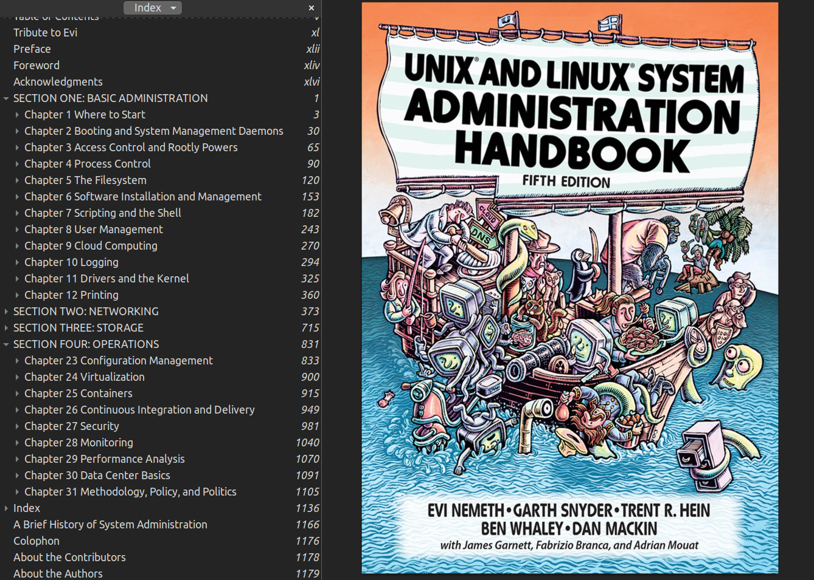

[About Me](/about/)

    <h1 style="font-size: 3rem; font-weight: 300;">CSPB 3112 - Mark Wilkening</h1>
    
Tracking my project

## Week 13 Update ::  April 15, 2025 - April 22, 2025

This week I completed modules on:

**LDAP** Directory services via IP protocol. It provides database style functionality engineered to eb fast, computationally lightweight, and robust.
I learned about LDAP Authentication, and completed a lab exercise of installing an LDAP server on a virtual machine.

**Firewalls** One of the most ubiquitous terms in computing that I believe most non-tech people are aware of. "Is it the firewall?" they say in a 
meeting when anything goes wrong.It was interesting to learn more about them. I knew some of the basics, but learned about Zones Management, Source
Management, and Port Management.

**System INIT/SysteMD History** Learned about the init program that is the first user level process or task run on the sytem and continues to run until
the system is shut down. The 3 most common implementations of init include systemd, Upstart, and SysVinit, and now all major distributions have moved to
systemd.

**Backup and Recovery Methods** The basics of backup media (tape, CD, DVD, hard disk, etc) and the general importance of backuping up properly. I also learned
about backing up incrementally with tar using compression methods.

I'm almost done! Only 2 real modules left (Linux Security Modules and System Rescue).

## Week 12 Update ::  April 7, 2025 - April 14, 2025

I completed modules this week on Devices and UDEV, Network Addresses, Network Devices and Configuration. I used a similar technique as last week where
I prompted ChatGPT to give me a few exercises to help the concepts sink in and I've found this method to be helpful. I like doing tasks rather than just
reading or watching videos to learn.

Next week I'll move on to modules on LDAP, Firewalls, System INIT: SystemMD History and Customization, Backup and Recovery Methods.

## Week 11 Update ::  March 31, 2025 - April 6, 2025

I tried a little different approach this week in an effort to get a more hands on approach to these modules. After reading through the section on 
Disk Partitioning, I prompted ChatGPT: 

**Is there a simple exercise or challenge I could try to better under disk partitioning on a Linux System?**

It responded with a Challenge Activity:

**Challenge: Create and partition a virtual disk using a loopback device
This lets you practice partitioning without touching your real disk. It's all done in a file.**

This was so much better than just reading through the modules and participating in the end of module activities which I felt were many times 
either too easy, or clearly more advanced than what I had just learned in the module. The activity had me create a virtual disk file, turn
it into a loop device, partition the virtual disk, refresh the kernel's view of the partition, create a filesystem on the new partition, 
mount it, and then use it (created some basic txt files on the disk). I got hung up on a few things, but went back and retried, checked
my commands, and figured it out. 

I continued this method with a few other topics from the modules this week on Filesystem Features and the EXT4 Filesystem.

Next week I will dive into Logical Volume Management (LVM), Kernel Services and Configuration, and Kernel Modules.

## Week 10 Update ::  March 17, 2025 - March 23, 2025

I've heard about Containers for a long time and knew of their importance, generally. I realized that I thought they were more similar to
virtual machines. This week, I studied them in depth, specifically learning Docker and docker-composer functionality. I watched 
[this](https://www.youtube.com/watch?v=Ud7Npgi6x8E) video which was a good intro. 

I also learned about I/O Monitoring, Scheduling, and Tuning using tools *iostat, and iotop*.

Lastly I studied the Linux Filesystem, what a "journaling" filesystem is, and the specific layout of the VFS (Virtual Filesystem).

Next week/the week after Spring Break, I will complete modules on Disk Partitioning, Filesystem Features, and The EXT4 Filesystem.

## Week 9 Update ::  March 10, 2025 - March 16, 2025

This week I completed a module on Memory Monitoring, Usage and Configuring Swap. Because I've been interested in computing most of my life, 
I remember thinking there'd be a day when RAM and CPU would be so large and cheap that it would no longer be a prohibiting factor to any needed 
computing. Yet here we are, with 4K video streaming and live audio recording between 2 studios in different parts of the world. 

I learned about the tools *free, vmstat, and pmap*. This entails tuning the memory of a sub-system, and changing memory paramters to improve I/O performance. 

I also learned about using swap which takes advantage of Linux's virtual memory system. 

Next week I will complete modules on I/O Monitoring, Containers Overview, Linux Filesystems and The VFS.

## Week 8 Update ::  March 3, 2025 - March 9, 2025

This week I started by completing a module on Git fundamentals. A lot of this was review and I've learned Git in 3308 and have used it for many classes here at UCB. I did learn about tags,
which I wasn't previously familiar with. I know that git is very important for software engineers so the more I'm familiar with it the better. I took notes on some of the standard
git commands and also learned a few I hadn't heard of before.

Next were modules on Linux Processes and Process Monitoring. This included a variety of topics that were covered in CSPB2400, such as:

- fork & exec
- process state: running, zombie, waiting, stopped
- background & foreground processes, using '&'
- setting hard/soft open file limits with **ulimit** 
- reading/changing a process' "niceness", or their resource intensity
- scheduling periodic tasks using **cron**
- all the flags for ps
- using top

I reviewed Chapter 4 in ULSAH as it covered Processes and was supplementary to the modules this week. No blockers.

## Lifelong Learning Resources

I started by poking around the UCB Career Services site. The first thing that caught my eye was the "Customized Skills Report". There have been a lot of rumors about the
(poor) state of the job market in Tech right now, and I was curious what a job report would indicate. I filled out my information on the form, and hit 'send'.

While I didn't utilize CU's Photobooth as I'm a remote student, it did encourage me to explore an updated headshot, as mine is definitely outdated. Professor Guinn
also encouraged me to update my LinkedIn as it still only reflects my current job/industry. I had some friends use AI Headshot Generators for their Zoom profile, so I checked out BetterPic.io.
I uploaded 6 photos from my phone where I was looking at the camera in decent lightning, took 2 selfies, chose an outfit ("Business/Navy") and a background ("studio"), paid $35,
and 30 minutes later I had 20 headshots. I'm certainly not going to get into the ethics of AI headshots here, but I know that I wouldn't have hired a headshot photographer for this, seeing as
they run hundreds of dollars, and this was only for a LinkedIn profile photo, not an actor's headshot. I think what I ended up with was a clear improvement and generally reflects what I look like now.
My LinkedIn now has a new profile photo, I've added UCB to my education, and I'm working on adding additional software related skills to my profile. 

I checked out the Google Career Certificates with the CU partnership. This seemed helpful, and I bookmarked it, as I am interested in completing the Cybersecurity certificate which seems similar
to the Linux SysAdmin training I'm currently studying, and if CU can get it for free, all the better.

I requested a license for the Quinncia AI resume builder, and am waiting to hear back.

In general, the LinkedIn learning services, like most free content, is not thorough or very useful. A 3 minute video on "What is Software Development" is not going to help me much 3 years
into a CS degree. I tried to enter more pointed skills (software development, C++, etc.), but then I got content like "Learn the basic syntax of C++".

There are so many "skills" that it can be argued you "need" to succeed in the 2025 job market that it is overwhelming. I'm trying to keep pushing ahead with becoming more valuable with a few solid
skills and rely on my 20 years of work experience for the rest.

## Week 7 Update :: February 24 - March 2, 2025

This week I continued with learning about package management, but dove more specifically into RPM, dnf, yum, and zypper which are used on Red Hat, Fedora, and openSUSE systems. 

I found a very helpful Github page of notes from the ULSAH book I've been reading, linked [here](https://github.com/abdoufermat5/unix-and-linux-sysadmin-notes/tree/main).
This inspired me to start my own page of notes while going thru the modules from the Linux Foundation.

[My LFS 207 Notes](https://github.com/markwilkening21/lfs207_notes)

This is refamiliarzing me to Markdown. I installed a Markdown viewer in Brave so I can avoid having to constantly push changes to check
the formatting, and I've found this method of creating notes helps me retain the information better.

- A few small blockers this week. The material in the book is getting pretty challenging and I've slowed down in pace. I'm not finished with Chapter 5 
but will continue powering through. 

- I've been using Ubuntu to test out what I've been learning, and ended up wasting a lot of time troubleshooting trying to get openSUSE
running on VirtualBox. It was not as seamless as Ubuntu, and it took a few tries to get it working. Finally after getting it installed,
I realized some of the Learning Exercises required Red Hat or Fedora, not openSUSE, so I couldn't do the dnf based problem sets. 

- Each module on the Linux Foundation site includes Lab exercises at the end of each chapter. Sometimes the questions were not covered at all in the module, so
I end up having to Google the answer. This is confusing -- is this intentional? (I'm wondering)

Next week I'll move on to topics on Git Fundamentals, Processes, and Process Monitoring. I'll finish Chapter 5 in ULSAH and move onto Chapter 6.

## Week 6 Update :: February 17 - February 23, 2025

I've been peripherally familiar with Package Management Systems DPKG and APT for a few years, as I would come across the term when I was Googling for help figuring
out why a piece of software on my Linux desktop computer wasn't working properly. I have been typing "apt install" or "sudo apt-get something something" over
and over for years. I finally dove in and learned more than the basics of what is going on under the hood. I work at a very small company, and when we
need to update software on a computer, we individually update that 1 machine. The idea of using a package management system is very attractive and one of
the main benefits -- you can update 10,000 machines efficiently.

Getting more familiar with some of the dpkg tools was very helpful, like:

List all packages installed:

**$ dpkg -l 
$ dpkg --list**

List files installed in the wget package:

**$ dpkg -L wget**

Show information about an installed package:

**$ dpkg -s wget**

This was a very functional/useful week of learning. No blockers.

I read Chapter 4 - Process Control and will read Chapter 5 next. Next week I will also complete modules on Red Hat Package Management, DNF and Yum, Zipper, and possibly get started on Git fundamentals.

## Week 5 Update :: February 10 - February 16, 2025

This week I completed sections/modules on Group Management, File Permissions, and Ownership in a Linux system. I learned to 
* add new users
* modify their passwords 
* add them and remove them from groups 
* login to their accounts remotely
* set ownership of files or directories to groups
* modify file permissions using chmod
* understand octal shorthand of permissions
* use chown and chgrp to change file ownership or group ownership
* use umask (user file creation mask) to set default file and directory permissions when new files are created

I read Chapter 3, Access Control and Rootly Powers, in the UNIX/Linux book I mentioned last week. 

Next I will be working on Modules about Package Management Systems, DPKG, and APT.

I'm moving at a good pace, I really enjoy the format of the modules and I love messing around in Ubuntu using a VM. No blockers.

## Week 4 Update :: February 3 - February 9, 2025

This week I started reading _The Unix and Linux System Administration Handbook_. I had heard of this book spoken of very highly, but didn't realize the very strong UCB connection until I started it. 
The opening has a tribute to [Evi Nemeth](https://en.wikipedia.org/wiki/Evi_Nemeth), who was a Computer Science professor at UCB.

Anyway, I read the first 2 chapters which included an introductory chapter on the roles of a system administrator, and a chapter on Booting and System Management Daemons. 

In the LFS207 Module, I completed chapters on User Environment (Ch 3) and User Account Management (Ch 4).

This week I will move on to Chapters 5 (Group Management) and 6 (File Permissions) in LFS207, and I'll start reading Chapter 3 in the Unix/Linux Book.

I'm not blocked, and I'm getting into a routine of knocking out a little at a time in 30-60 minutes increments.

## Week 3 Update :: January 27 - February 2, 2025

This week I wrote my project proposal and officially decided to start working on the Linux Foundation System Administration course. I signed up and paid for the course, and started watching 
and reading the introductory material. I learned about the basic differences between Linux distributions and setup a virtual machine in case there are specific differences between my personal 
machine (running pop_os) and the instructions in Ubuntu, centOS, or openSUSE. I chose to setup a VM with Ubuntu because I already have experience working with it and know how to set it up. 
I read/watched the Intro content which I was already familiar with and setup my PATH in .bashrc to search **sbin** when doing a normal system search to find system utilities. I completed 
the chapter on the Linux Filesystem Tree Layout, which details how files are organized on a Linux system. It then breaks down what is contained in each of the ~18 system directories, 
from /bin to /run. 

Next week I will work my way through chapters on the User Environment and User Account Management. Splitting the time up in management chunks is very helpful for me rather than knocking 
out 3 hours on a Saturday. As long as my schedule allows, I will continue to use this method.

## Project Proposal :: January 28, 2026

I wish to build a base of skills in Linux System Administration. Using the Linux Foundation training tools, I plan to engage in weekly learning sessions that will ultimately lead to a 
Linux Foundation Certified System Administrator (LFCS) cerftification after taking the exam. 

I want to expand my skillset to contribute to my hirability and help in my job search. I think understanding Linux on this level will be useful whether I become a System Admin or not. 
I’ve always been interested in this topic, I’d now like to seriously increase my understanding of it.

* Some of the topics covered in this course:
* Linux Filesystem Tree Layout
* User Environment
* User Account Management
* Group Management
* File Permissions and Ownership
* Package Management Systems
* dpkg, APT, RPM, dnf, yum, zypper
* GIT Fundamentals
* Processes and Process Monitoring
* Memory Monitoring, Usage and Configuring Swap

The course estimates 50-60 hours worth of learning material is available. This is just beyond the 45 hours allotted for the project, so I understand I may not complete 100% of the materials by the 
end of the semester. I will try to cover 2 chapters each week, as there are 34 chapters in the course. As long as I spend 3-5 hours a week on this material, I will have a much greater understanding
of the material at the end of the semester and should be close to completing the course and preparing for the certification exam. The course costs $299. 

## Week 2 Update :: January 20-26, 2025

Last week I spent time brainstorming about semester project ideas. As I've been slowly applying for jobs for the past year without success, I wanted to work on something for my resume that was
concrete with a definitive line item, rather than just putting "C++" under "Languages" which can obviously be pretty dynamic as to someone's level. I've been interested in Linux/SysAdmin
for awhile and started poking around linuxfoundation.org and am considering working toward a [LFCS](https://training.linuxfoundation.org/training/linux-system-administration-essentials-lfs207/) 
(Linux Foundation Certified System Administrator). I also spent time reading and watching tutorials on Jekyll to start building my personal site for this class.

This week I'm going to spend some time exploring other ideas for a semester project, possibly furthering my knowledge of Python or C++ on Leetcode or Exercism.

I'm currently not blocked in any way.

I think my process will fall into form more specifically after I choose a project.
